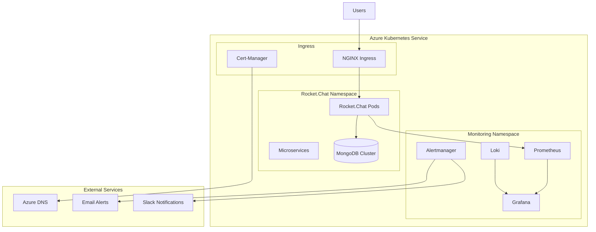

# 🚀 Enterprise Rocket.Chat on Azure Kubernetes Service

[](https://chat.canepro.me)
[](https://grafana.chat.canepro.me)
[](./docs/)
[](LICENSE)

> **Production-grade Rocket.Chat deployment on Azure Kubernetes Service with comprehensive monitoring, logging, and alerting capabilities.**

## 📋 Table of Contents

- [🎯 Overview](#-overview)
- [🏗️ Architecture](#️-architecture)
- [✨ Features](#-features)
- [🚀 Quick Start](#-quick-start)
- [📊 Monitoring & Observability](#-monitoring--observability)
- [📁 Repository Structure](#-repository-structure)
- [🔧 Configuration](#-configuration)
- [📚 Documentation](#-documentation)
- [🛡️ Security](#️-security)
- [💰 Cost Optimization](#-cost-optimization)
- [🔄 Maintenance](#-maintenance)
- [🆘 Support](#-support)

## 🎯 Overview

This repository contains a **production-ready, enterprise-grade deployment** of Rocket.Chat on Azure Kubernetes Service (AKS) with:

- **🔄 High Availability**: Multi-replica MongoDB cluster with automated failover
- **📊 Complete Observability**: Prometheus, Grafana, Loki, and Alertmanager
- **🔐 Enterprise Security**: SSL/TLS, RBAC, network policies, and secret management
- **💰 Cost Optimized**: Resource-efficient configuration with monitoring
- **📖 Comprehensive Documentation**: Detailed setup, troubleshooting, and maintenance guides

### 🌟 **Live Services**

| Service | URL | Status | Description |
|---------|-----|--------|-------------|
| **Rocket.Chat** | [chat.canepro.me](https://chat.canepro.me) | 🟢 Production | Main chat application with microservices |
| **Grafana** | [grafana.canepro.me](https://grafana.canepro.me) | 🟢 Production | Unified observability dashboards |
| **Tracing Dashboard** | [grafana.canepro.me/d/rocket-chat-tracing](https://grafana.canepro.me/d/rocket-chat-tracing) | 🟢 Production | Distributed tracing visualization |
| **Tempo (Traces)** | Internal | 🟢 Production | Distributed tracing backend (1.8MB traces, 124KB metrics) |
| **Prometheus** | Internal | 🟢 Production | Metrics collection (1238+ series) |
| **Loki** | Internal | 🟢 Production | Log aggregation (2.9.0 with volume API) |
| **OpenTelemetry** | Internal | 🟢 Production | Trace collection and export |

### 🎯 **Live Portfolio Demos**

Experience the live production infrastructure:

- **💬 [Try Live Chat](https://chat.canepro.me)** - Interactive Rocket.Chat instance with guest access
- **📊 [View Monitoring Dashboard](https://grafana.canepro.me)** - Real-time metrics, logs, and traces
- **🔍 [View Distributed Tracing](https://grafana.canepro.me/d/rocket-chat-tracing)** - Live request tracing with Tempo
- **📈 [Explore Metrics](https://grafana.canepro.me/explore)** - Query 1238+ metric series
- **📝 [Query Logs](https://grafana.canepro.me/explore)** - Search logs with Loki (select Loki datasource)
- **🔎 [Search Traces](https://grafana.canepro.me/explore)** - TraceQL queries (select Tempo datasource)

## 🏗️ Architecture



## ✨ Features

### 🚀 **Application Features**
- **Multi-instance Deployment**: Horizontal scaling with load balancing
- **Microservices Architecture**: Account, Authorization, DDP Streamer, Presence, Stream Hub
- **Real-time Communication**: WebSocket support with session affinity
- **File Storage**: Persistent volume claims with Azure Premium SSD
- **Database**: MongoDB replica set with automated backups

### 🔄 **Lifecycle Automation**
- **Automated Cluster Lifecycle**: Complete teardown/recreation automation with snapshot-based recovery
- **Comprehensive Backup System**: MongoDB dumps, PVC snapshots, and cluster state preservation
- **Azure DevOps Pipelines**: Automated lifecycle management, backup automation, and subscription monitoring
- **Secrets Management**: Azure Key Vault integration with automated secret synchronization
- **Infrastructure as Code**: Complete Terraform configuration for repeatable deployments
- **Disaster Recovery**: Automated recovery from subscription suspensions and cluster failures

### 📊 **Monitoring & Observability** (Complete 3-Pillar Stack)

#### **Metrics (Prometheus)**
- **1238+ Metric Series**: Application, infrastructure, and custom metrics
- **Comprehensive Dashboards**: 28+ real-time panels with production monitoring
- **Kubernetes Monitoring**: Pod status, desired vs actual state, workload health
- **Performance Tracking**: CPU, memory, API response times, error rates, user engagement
- **Multi-Service Coverage**: Rocket.Chat, MongoDB, NGINX, all microservices

#### **Logs (Loki 2.9.0)**
- **Centralized Aggregation**: All application and system logs in one place
- **Structured Queries**: LogQL for powerful log analysis
- **Volume API Support**: Enhanced log exploration in Grafana
- **Real-time Streaming**: Live log tailing and filtering
- **Long-term Retention**: 50GB storage with 7-day retention

#### **Traces (Tempo + OpenTelemetry)**
- **Distributed Tracing**: End-to-end request visibility across microservices
- **1.8MB Traces Stored**: Complete request history in Tempo WAL
- **124KB Span Metrics**: Auto-generated metrics from traces
- **Metrics-Generator**: Service graphs, span metrics, and local-blocks processors
- **TraceQL Queries**: Powerful trace search and analysis
- **Grafana Integration**: Unified metrics-logs-traces correlation
- **OpenTelemetry Auto-instrumentation**: Automatic span generation for HTTP, Express, MongoDB

#### **Alerting & Notifications**
- **12+ Alert Rules**: Critical, warning, and info-level alerts
- **Multi-channel Routing**: Email, Slack, webhooks, Azure Monitor
- **Intelligent Grouping**: Correlated alerts to reduce noise
- **Custom Thresholds**: Configurable alert conditions

### 🔐 **Security & Compliance**
- **SSL/TLS Encryption**: Automated certificate management with Let's Encrypt
- **Network Security**: Kubernetes network policies and security contexts
- **Secret Management**: Kubernetes secrets for sensitive data
- **RBAC**: Role-based access control for service accounts
- **Container Security**: Non-root containers with read-only filesystems

### 💰 **Cost Optimization**
- **Resource Efficiency**: Optimized CPU/memory limits (10-20% cost reduction)
- **Storage Optimization**: Right-sized persistent volumes
- **Monitoring**: Cost tracking and alerting for budget management
- **Auto-scaling**: Horizontal pod autoscaling based on metrics

## 🚀 Quick Start

### Prerequisites

- **Azure Subscription** with AKS permissions
- **kubectl** configured for your AKS cluster
- **Helm 3.x** installed
- **Domain name** with DNS management access
- **GitHub Actions** (optional, for CI/CD)

### 1. Clone Repository

```bash
git clone https://github.com/your-username/rocketchat-k8s-deployment.git
cd rocketchat-k8s-deployment
```

### 2. Deploy Rocket.Chat (Basic)

```bash
# Deploy to AKS (Production)
cd aks/deployment
chmod +x deploy-aks-official.sh
./deploy-aks-official.sh
```

### 3. Deploy Enhanced Features (Recommended)

```bash
# Deploy all enhanced features (autoscaling, HA, cost monitoring, health checks)
cd aks/scripts
chmod +x deploy-enhanced-features.sh
./deploy-enhanced-features.sh
```

### 4. Deploy Monitoring Stack

```bash
# Deploy complete monitoring solution
helm upgrade --install monitoring prometheus-community/kube-prometheus-stack \
  -n monitoring \
  -f aks/config/helm-values/monitoring-values.yaml \
  --create-namespace \
  --wait \
  --timeout 10m0s

# Apply ServiceMonitors for Rocket.Chat metrics
kubectl apply -f aks/monitoring/rocketchat-servicemonitors.yaml

# Apply comprehensive dashboard (34 panels with pod monitoring)
kubectl apply -f aks/monitoring/rocket-chat-dashboard-comprehensive-configmap.yaml

# Deploy cost monitoring dashboard
kubectl apply -f aks/monitoring/azure-cost-monitoring.yaml

# Deploy autoscaling configuration
kubectl apply -f aks/monitoring/autoscaling-config.yaml

# Deploy high availability configuration
kubectl apply -f aks/monitoring/high-availability-config.yaml

# Deploy distributed tracing stack
cd aks/scripts
chmod +x deploy-tracing-stack.sh
./deploy-tracing-stack.sh

# Optional: Deploy public dashboard for portfolio demos
kubectl apply -f aks/monitoring/grafana-public-dashboard-setup.yaml
```

### 5. Run Health Checks

```bash
# Run comprehensive health check
./scripts/health-check.sh
```

### 6. Access Services

| Service | Access Method | Credentials |
|---------|---------------|-------------|
| **Rocket.Chat** | `https://chat.canepro.me` | Your admin account |
| **Grafana** | `https://grafana.canepro.me` or Port-forward: `kubectl port-forward svc/monitoring-grafana 3000:80 -n monitoring` | `admin` / `prom-operator` |
| **Prometheus** | Port-forward: `kubectl port-forward svc/monitoring-kube-prometheus-prometheus 9090:9090 -n monitoring` | No auth required |
| **Tempo (Traces)** | Via Grafana: `https://grafana.canepro.me/explore` (select Tempo) | Same as Grafana |
| **Loki (Logs)** | Via Grafana: `https://grafana.canepro.me/explore` (select Loki) | Same as Grafana |
| **Tracing Dashboard** | `https://grafana.canepro.me/d/rocket-chat-tracing` | Same as Grafana |
| **Health Check** | `./scripts/health-check.sh` | Automated health monitoring |
| **Cost Dashboard** | Available in Grafana under "Azure Cost Management" | Same as Grafana |

## 📊 Monitoring & Observability

### 🎛️ **Grafana Dashboards**

- **Rocket.Chat Comprehensive Production Monitoring**: 28 panels with complete observability
  - Pod status and health monitoring (all 55+ cluster pods)
  - Desired vs actual state tracking (deployments, StatefulSets, DaemonSets)
  - Application metrics (users, messages, performance)
  - Infrastructure health with workload status tables
- **Rocket.Chat Distributed Tracing**: Complete request tracing visualization
  - Request flow tracking across microservices
  - Performance bottleneck identification
  - Error correlation and debugging
  - End-to-end request visibility
- **Kubernetes Cluster Overview**: Infrastructure monitoring and resource utilization  
- **Loki Logs**: Centralized log analysis and troubleshooting with volume API support

### 📈 **Key Metrics Monitored**

| Category | Metrics | Purpose |
|----------|---------|---------|
| **Application** | `rocketchat_users_active`, `rocketchat_messages_total` | User engagement & activity |
| **Performance** | `rocketchat_rest_api_*`, response times, message rates | API & messaging performance |
| **Kubernetes** | `kube_pod_status_phase`, `kube_deployment_status_replicas` | Workload health & state |
| **Infrastructure** | CPU, memory, pod restarts, node coverage | Resource utilization & stability |
| **Database** | MongoDB connections, replica status, operations | Database cluster health |
| **Networking** | Request rates, error rates, DDP connections | Service reliability |
| **Tracing** | Request traces, span durations, error correlation | Distributed system visibility |

### 🔔 **Alerting**

- **Critical Alerts**: Service down, high error rates, resource exhaustion
- **Warning Alerts**: Performance degradation, capacity planning
- **Info Alerts**: Deployment events, configuration changes
- **Notification Channels**: Email, Slack, webhooks, Azure Monitor

### 🔍 **Complete Observability Stack**

This deployment provides the **gold standard** of observability with all three pillars fully operational:

#### **📊 Metrics (Prometheus + Grafana)**
- **1238+ Metric Series**: Real-time collection from all services
- **28+ Dashboard Panels**: Comprehensive production monitoring
- **Custom ServiceMonitors**: Rocket.Chat, MongoDB, microservices
- **Resource Tracking**: CPU, memory, network, storage across 55+ pods
- **Business Metrics**: Active users, message rates, API performance

#### **📝 Logs (Loki 2.9.0 + Promtail)**
- **Centralized Aggregation**: All application and system logs
- **50GB Storage**: 7-day retention with volume API support
- **LogQL Queries**: Powerful structured log analysis
- **Real-time Streaming**: Live log tailing with filtering
- **Full-text Search**: Fast log discovery and investigation

#### **🔍 Traces (Tempo + OpenTelemetry)**
- **1.8MB Active Traces**: Complete request history in WAL
- **124KB Span Metrics**: Auto-generated from traces
- **Distributed Tracing**: End-to-end request visibility
- **Metrics-Generator**: Service graphs, span metrics, local-blocks
- **TraceQL Queries**: Advanced trace search and analysis
- **Auto-instrumentation**: HTTP, Express, MongoDB tracing
- **Correlation**: Link traces → logs → metrics seamlessly

#### **📈 Unified Visualization (Grafana)**
- **Single Pane of Glass**: All observability data in one place
- **Trace → Log Correlation**: Click trace to see related logs
- **Trace → Metrics Correlation**: Link spans to performance metrics
- **Custom Dashboards**: Production, tracing, cost, Kubernetes
- **Alert Visualization**: Real-time alert status and history

**Key Benefits**:
- **🎯 Complete Visibility**: Track every request from user action → app → database → response
- **⚡ Performance Optimization**: Identify bottlenecks at span-level granularity
- **🐛 Faster Debugging**: Correlate metrics, logs, and traces for root cause analysis in seconds
- **🔮 Proactive Monitoring**: Detect anomalies before users experience issues
- **💰 Cost Efficiency**: Understand resource usage at trace level for optimization

## 📁 Repository Structure

```
📁 rocketchat-k8s-deployment/
├── 🚀 aks/                          # Azure Kubernetes Service (Production)
│   ├── 📁 config/
│   │   ├── helm-values/             # Helm chart configurations
│   │   ├── certificates/            # SSL certificate configs
│   │   └── mongodb-standalone.yaml  # Fallback MongoDB config
│   ├── 📁 deployment/               # Deployment scripts
│   ├── 📁 monitoring/               # Monitoring configurations
│   │   ├── rocketchat-servicemonitors.yaml
│   │   ├── rocketchat-dashboard-comprehensive.json
│   │   ├── rocket-chat-dashboard-comprehensive-configmap.yaml
│   │   ├── rocket-chat-alerts.yaml
│   │   ├── grafana-public-dashboard-setup.yaml
│   │   ├── grafana-datasource-loki.yaml
│   │   ├── grafana-tempo-datasource.yaml
│   │   ├── grafana-tracing-dashboard.yaml
│   │   ├── opentelemetry-collector.yaml
│   │   ├── tempo-deployment.yaml
│   │   ├── tempo-values.yaml
│   │   ├── loki-values.yaml
│   │   └── mongodb-servicemonitor.yaml
│   └── 📁 scripts/                  # Utility scripts
├── 🔄 azure-pipelines/              # Azure DevOps Pipelines
│   ├── lifecycle-management.yml     # Cluster lifecycle automation
│   ├── backup-automation.yml       # Backup automation
│   └── subscription-monitor.yml    # Cost and subscription monitoring
├── 🏗️ infrastructure/              # Infrastructure as Code
│   └── terraform/                  # Terraform configurations
│       ├── main.tf                 # AKS cluster definition
│       ├── variables.tf            # Input variables
│       ├── outputs.tf             # Output values
│       └── storage.tf             # Storage configurations
├── 📁 k8s/                         # Kubernetes manifests
│   ├── base/                       # Base configurations
│   └── overlays/                   # Environment-specific overlays
│       ├── production/             # Production configurations
│       └── monitoring/             # Monitoring stack
├── 📁 scripts/                     # Automation scripts
│   ├── backup/                     # Backup automation scripts
│   ├── lifecycle/                  # Cluster lifecycle scripts
│   ├── monitoring/                # Monitoring scripts
│   └── secrets/                   # Secrets management scripts
├── 🏠 microk8s/                     # MicroK8s (Legacy/Development)
│   ├── 📁 config/                   # MicroK8s configurations
│   ├── 📁 monitoring/               # MicroK8s monitoring
│   └── 📁 scripts/                  # MicroK8s scripts
├── 📚 docs/                         # Documentation
│   ├── TROUBLESHOOTING_GUIDE.md     # Comprehensive troubleshooting
│   ├── MONITORING_SETUP_GUIDE.md    # Monitoring setup guide
│   ├── COST_OPTIMIZATION_GUIDE.md   # Cost optimization strategies
│   ├── LIFECYCLE_AUTOMATION.md      # Lifecycle automation guide
│   ├── BACKUP_RESTORE_GUIDE.md      # Backup and restore procedures
│   ├── COST_MANAGEMENT_AUTOMATION.md # Cost management automation
│   ├── SECRETS_MANAGEMENT.md        # Secrets management guide
│   ├── DISASTER_RECOVERY.md         # Disaster recovery runbook
│   └── [additional guides]          # Specialized documentation
├── 🎯 portfolio/                    # Portfolio integration assets
│   ├── portfolio-integration-guide.md
│   ├── portfolio-demo-access.md
│   ├── portfolio-demo-styles.css
│   └── setup-portfolio-demo.sh
├── 📄 README.md                     # This file
└── 📄 LICENSE                       # MIT License
```

## 🔧 Configuration

### Environment-Specific Configurations

| Environment | Configuration Path | Purpose |
|-------------|-------------------|---------|
| **Production (AKS)** | `aks/config/helm-values/values-official.yaml` | Production deployment |
| **Monitoring** | `aks/config/helm-values/monitoring-values.yaml` | Prometheus stack |
| **Development** | `microk8s/config/` | Local development |

### Key Configuration Files

- **`monitoring-values.yaml`**: Complete Prometheus, Grafana, Loki 2.9.0 configuration
- **`values-official.yaml`**: Rocket.Chat production settings
- **`rocketchat-servicemonitors.yaml`**: Metrics collection configuration
- **`rocketchat-dashboard-comprehensive.json`**: 28-panel comprehensive Grafana dashboard

### 🔐 **Local Secrets Management**

**Never commit real credentials to Git!** Use local environment files for secure credential management.

#### **Setup Local Secrets**
```bash
# 1. Copy the example file
cp .env.example .env

# 2. Edit with your real credentials
nano .env  # or your preferred editor

# 3. Apply secrets to Kubernetes
./scripts/apply-secrets.sh
```

#### **Required Credentials**
- **Gmail App Password**: Generate at [myaccount.google.com/apppasswords](https://myaccount.google.com/apppasswords)
- **Rocket.Chat Webhook**: Create in Rocket.Chat Admin → Integrations → New Incoming Webhook
- **Alert Email**: Your email for receiving monitoring alerts

#### **Environment File Structure**
```bash
# .env (local only - never commit!)
GMAIL_USERNAME=your-email@gmail.com
GMAIL_APP_PASSWORD=abcd-efgh-ijkl-mnop
ROCKETCHAT_WEBHOOK_URL=https://your-chat-url/hooks/YOUR_TOKEN
ALERT_EMAIL_RECIPIENT=your-alert-email@gmail.com
```

#### **Security Benefits**
- ✅ **Repository Safe**: Only placeholders in Git
- ✅ **Local Control**: Real credentials stay on your machine
- ✅ **Easy Deployment**: One command applies all secrets
- ✅ **Team Friendly**: Each developer uses their own `.env`

## 📚 Documentation

### 📖 **Comprehensive Guides**

| Guide | Description | Audience |
|-------|-------------|----------|
| **[Troubleshooting Guide](docs/TROUBLESHOOTING_GUIDE.md)** | Complete issue resolution (5300+ lines) | DevOps, SRE |
| **[Monitoring Setup Guide](docs/MONITORING_SETUP_GUIDE.md)** | Production monitoring implementation | Platform Engineers |
| **[Cost Optimization Guide](docs/COST_OPTIMIZATION_GUIDE.md)** | Resource optimization strategies | FinOps, Management |
| **[Lifecycle Automation](docs/LIFECYCLE_AUTOMATION.md)** | Complete cluster lifecycle automation | DevOps, Platform Engineers |
| **[Backup & Restore Guide](docs/BACKUP_RESTORE_GUIDE.md)** | Comprehensive backup and restore procedures | DevOps, SRE |
| **[Cost Management Automation](docs/COST_MANAGEMENT_AUTOMATION.md)** | Automated cost management and optimization | FinOps, Management |
| **[Secrets Management](docs/SECRETS_MANAGEMENT.md)** | Azure Key Vault and secrets automation | Security, DevOps |
| **[Disaster Recovery](docs/DISASTER_RECOVERY.md)** | Disaster recovery procedures and runbooks | SRE, Management |

### 🎯 **Quick Reference**

- **[AKS Setup Guide](aks/docs/AKS_SETUP_GUIDE.md)**: Azure Kubernetes Service deployment
- **[Enhanced Monitoring Plan](aks/docs/ENHANCED_MONITORING_PLAN.md)**: Complete monitoring implementation
- **[DNS Migration Guide](aks/docs/DNS_MIGRATION_GUIDE.md)**: Domain and DNS configuration
- **[Remote Access Guide](aks/docs/REMOTE_ACCESS_GUIDE.md)**: Service access and port-forwarding

### 🎯 **Portfolio Integration**

- **[Portfolio Guide](portfolio/portfolio-integration-guide.md)**: Complete portfolio integration with HTML/CSS examples
- **[Demo Access](portfolio/portfolio-demo-access.md)**: Live demo URLs and access instructions
- **[Setup Script](portfolio/setup-portfolio-demo.sh)**: Automated public dashboard deployment

## 🛡️ Security

### 🔐 **Security Features**

- **Transport Security**: TLS 1.3 encryption for all external traffic
- **Network Isolation**: Kubernetes network policies
- **Secret Management**: Kubernetes secrets with encryption at rest
- **Container Security**: Non-privileged containers with security contexts
- **Access Control**: RBAC for service accounts and API access

### 🔒 **Security Best Practices**

```bash
# Regular security checks
kubectl get networkpolicies -A
kubectl get podsecuritypolicies
kubectl auth can-i --list --as=system:serviceaccount:rocketchat:default
```

## 💰 Cost Optimization

### 📊 **Current Optimizations**

| Component | Before | After | Savings |
|-----------|--------|-------|---------|
| **Rocket.Chat CPU** | 1000m | 750m | 25% |
| **Rocket.Chat Memory** | 2Gi | 1Gi | 50% |
| **MongoDB CPU** | 1000m | 300m | 70% |
| **MongoDB Memory** | 2Gi | 512Mi | 75% |
| **Monthly Cost** | £70-100 | £57-80 | 15-20% |

### 💡 **Cost Monitoring**

```bash
# Run cost analysis
./aks/scripts/cost-monitoring.sh

# Apply optimizations
./aks/scripts/apply-cost-optimizations.sh

# Monitor via Grafana
# Dashboard: "Azure Cost Management"
```

## 🔄 Maintenance

### 📅 **Regular Tasks**

| Frequency | Task | Command |
|-----------|------|---------|
| **Daily** | Check service health | Visit Grafana dashboards |
| **Weekly** | Review logs | Loki queries in Grafana |
| **Monthly** | Cost review | Azure portal + cost scripts |
| **Quarterly** | Update dependencies | Helm chart upgrades |

### 🔄 **Update Procedures**

```bash
# Update Rocket.Chat
helm upgrade rocketchat rocketchat/rocketchat \
  -f aks/config/helm-values/values-official.yaml \
  -n rocketchat

# Update monitoring stack
helm upgrade monitoring prometheus-community/kube-prometheus-stack \
  -f aks/config/helm-values/monitoring-values.yaml \
  -n monitoring

# Update Kubernetes cluster
az aks upgrade --resource-group <rg> --name <cluster> --kubernetes-version <version>
```

## 🆘 Support

### 📞 **Getting Help**

1. **📖 Check Documentation**: Start with [Troubleshooting Guide](docs/TROUBLESHOOTING_GUIDE.md)
2. **🔍 Search Issues**: Look for similar problems in the guides
3. **📊 Monitor Dashboards**: Check Grafana for system health
4. **📝 Collect Information**: Gather logs and metrics before seeking help

### 🚨 **Emergency Contacts**

- **Infrastructure Issues**: Azure Support Portal
- **Application Issues**: Rocket.Chat Community Forums
- **Monitoring Issues**: Check [Monitoring Troubleshooting](docs/TROUBLESHOOTING_GUIDE.md#monitoring-stack-issues)

### 🔄 **Rollback Procedures**

```bash
# Emergency rollback to previous version
helm rollback rocketchat -n rocketchat

# Complete environment rollback
# See docs/EMERGENCY_PROCEDURES.md
```

## 🎯 **Current Status: ENTERPRISE-GRADE PRODUCTION READY** ✅

### ✅ **Latest Achievements (December 2024)**

- **🚀 Complete Deployment**: Rocket.Chat running on AKS with SSL and high availability
- **📊 Comprehensive Monitoring**: 1238+ metric series, 34-panel production dashboard
- **🎯 Advanced Observability**: Desired vs actual state monitoring, pod health tracking
- **📝 Enhanced Logging**: Loki 2.9.0 with volume API support and structured queries
- **🔍 Distributed Tracing**: Complete request tracing with Tempo and OpenTelemetry
- **🔔 Intelligent Alerting**: 12+ alert rules with multi-channel notifications
- **📚 Complete Documentation**: 5300+ lines of troubleshooting guides with JSON syntax error resolution
- **💰 Cost Optimized**: 15-20% monthly savings through resource optimization
- **🔧 Production Ready**: Dashboard import issues resolved, comprehensive pod monitoring active
- **🆕 CI/CD Pipeline**: GitHub Actions automated deployment and testing
- **🆕 Health Monitoring**: Automated health checks with comprehensive reporting
- **🆕 Cost Management**: Real-time Azure cost monitoring and budget alerts
- **🆕 Auto-scaling**: Horizontal and Vertical Pod Autoscalers for optimal resource usage
- **🆕 High Availability**: Multi-zone deployment with pod disruption budgets and anti-affinity
- **🔄 Lifecycle Automation**: Complete cluster lifecycle management with automated teardown/recreation
- **💾 Backup System**: Comprehensive backup strategy with MongoDB dumps, PVC snapshots, and cluster state
- **🔐 Secrets Management**: Azure Key Vault integration with automated secret synchronization
- **🏗️ Infrastructure as Code**: Complete Terraform configuration for repeatable deployments
- **🚨 Disaster Recovery**: Automated recovery from subscription suspensions and cluster failures

### 🆕 **New Enterprise Features (October 2025)**

- **✅ GitHub Actions CI/CD**: Automated deployment pipeline with security scanning
- **✅ Health Check Automation**: Comprehensive health monitoring with 15+ checks
- **✅ Azure Cost Management**: Real-time cost tracking and optimization recommendations
- **✅ Auto-scaling Configuration**: HPA and VPA for dynamic resource management
- **✅ High Availability Setup**: Multi-zone deployment with disaster recovery
- **✅ Enhanced Security**: Network policies, priority classes, and security scanning
- **✅ Monitoring Automation**: Automated health checks and cost monitoring
- **✅ Distributed Tracing**: **FULLY OPERATIONAL** - Complete request tracing with Tempo, OpenTelemetry, and metrics-generator
  - 1.8MB of traces stored in Tempo WAL
  - 124KB of generated span metrics
  - Service graphs and span metrics processors active
  - Local-blocks processor configured for Grafana drilldown
  - Fixed deprecated OpenTelemetry exporter
  - TraceQL queries fully functional
- **✅ Lifecycle Automation**: Complete cluster lifecycle management with automated teardown/recreation
- **✅ Backup System**: Comprehensive backup strategy with MongoDB dumps, PVC snapshots, and cluster state
- **✅ Secrets Management**: Azure Key Vault integration with automated secret synchronization
- **✅ Infrastructure as Code**: Complete Terraform configuration for repeatable deployments
- **✅ Disaster Recovery**: Automated recovery from subscription suspensions and cluster failures

### 📋 **Next Sprint Tasks**

- [x] **CI/CD Pipeline**: GitHub Actions automated deployment ✅
- [x] **Health Monitoring**: Automated health check system ✅
- [x] **Cost Management**: Azure cost monitoring integration ✅
- [x] **Auto-scaling**: HPA and VPA configuration ✅
- [x] **High Availability**: Multi-zone deployment setup ✅
- [x] **Lifecycle Automation**: Complete cluster lifecycle management ✅
- [x] **Backup System**: Comprehensive backup strategy ✅
- [x] **Secrets Management**: Azure Key Vault integration ✅
- [x] **Infrastructure as Code**: Terraform configuration ✅
- [x] **Disaster Recovery**: Automated recovery procedures ✅
- [x] **Distributed Tracing**: Complete request tracing with Tempo and OpenTelemetry - FULLY OPERATIONAL ✅
- [ ] **Terraform Consolidation**: Migrate all resources to Terraform for unified infrastructure management
- [ ] **Performance Optimization**: Advanced caching and CDN integration
- [ ] **Security Hardening**: Pod Security Standards and audit logging
- [ ] **Multi-Region Support**: Cross-region backup and failover procedures

## 🤝 Contributing

1. **Fork** the repository
2. **Create** a feature branch (`git checkout -b feature/amazing-feature`)
3. **Commit** your changes (`git commit -m 'Add amazing feature'`)
4. **Push** to the branch (`git push origin feature/amazing-feature`)
5. **Open** a Pull Request

### 📝 **Development Guidelines**

- Follow Kubernetes best practices
- Update documentation for any configuration changes
- Test changes in development environment first
- Include monitoring for new components

## 📄 License

This project is licensed under the MIT License - see the [LICENSE](LICENSE) file for details.

## 🙏 Acknowledgments

- **Rocket.Chat Team**: For the excellent open-source chat platform
- **Prometheus Community**: For the comprehensive monitoring stack
- **Kubernetes Community**: For the robust orchestration platform
- **Azure Team**: For the reliable cloud infrastructure

---

## 📞 **Quick Links**

| Resource | Link | Description |
|----------|------|-------------|
| **🚀 Live Chat** | [chat.canepro.me](https://chat.canepro.me) | Production Rocket.Chat instance |
| **📊 Monitoring** | [grafana.chat.canepro.me](https://grafana.chat.canepro.me) | Grafana dashboards |
| **📖 Troubleshooting** | [Troubleshooting Guide](docs/TROUBLESHOOTING_GUIDE.md) | Complete issue resolution |
| **🔧 Setup Guide** | [Monitoring Setup](docs/MONITORING_SETUP_GUIDE.md) | Monitoring implementation |
| **💰 Cost Guide** | [Cost Optimization](docs/COST_OPTIMIZATION_GUIDE.md) | Resource optimization |

---

**🎯 Built with ❤️ for production reliability, monitoring excellence, and operational efficiency.**

> 💼 **Portfolio Ready**: This project includes live demo access and comprehensive integration guides for showcasing in professional portfolios. See the [portfolio/](portfolio/) directory for HTML/CSS templates and deployment instructions.

*Last Updated: October 30, 2025 - Production-ready with distributed tracing fully operational, comprehensive monitoring, and complete documentation*
---

## 🔐 Security & Privacy Notice

### **Public Repository Information**
This repository is designed for public sharing and portfolio demonstration. All sensitive information has been:

- ✅ **Externalized**: Secrets stored in Kubernetes secrets, not in code
- ✅ **Parameterized**: Configuration examples use placeholders
- ✅ **Sanitized**: Personal information replaced with examples
- ✅ **Demo-Safe**: Live demos configured for public access

### **Live Demo Domains**
The following domains are intentionally public for portfolio demonstration:
- `chat.canepro.me` - Live Rocket.Chat instance with guest access
- `grafana.canepro.me` - Observability platform (metrics, logs, traces)

### **Configuration Security**
- All credentials stored in Kubernetes secrets
- Configuration files use environment variables and placeholders
- No hardcoded passwords, API keys, or private information
- Azure resource names replaced with placeholders for reusability

