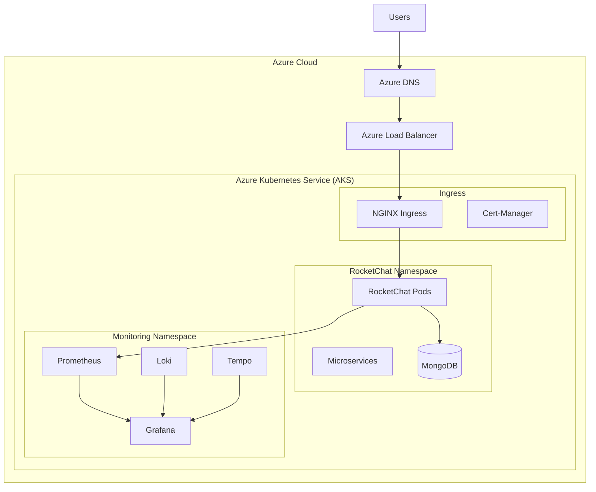

# 🚀 RocketChat on Azure Kubernetes Service - Template Repository

[](LICENSE)
[](https://kubernetes.io/)
[](https://www.terraform.io/)

> **Production-ready template** for deploying RocketChat on Azure Kubernetes Service (AKS) with comprehensive monitoring, logging, and alerting capabilities.

---

## ⚠️ THIS IS A TEMPLATE REPOSITORY

This repository provides a **complete, production-ready template** for deploying RocketChat on AKS. Before deploying, you must configure the following:

### 📝 Required Configuration

| Item | Description | Example |
|------|-------------|---------|
| **Domain Name** | Your domain for RocketChat | `chat.example.com` |
| **Grafana Domain** | Your monitoring dashboard domain | `grafana.example.com` |
| **Static IP** | Azure static IP for load balancer | Allocated via Azure Portal |
| **Azure Subscription** | Your Azure subscription ID | From Azure Portal |
| **Resource Group** | Azure resource group name | `rocketchat-prod-rg` |
| **DNS Access** | Ability to configure A records | DNS provider admin access |

### ✅ Quick Configuration Checklist

Before deploying, ensure you have:

- [ ] **Replaced `<YOUR_DOMAIN>`** in all configuration files
- [ ] **Replaced `<YOUR_GRAFANA_DOMAIN>`** in monitoring configs
- [ ] **Replaced `<YOUR_STATIC_IP>`** in infrastructure configs
- [ ] **Updated `terraform.tfvars`** with your Azure details
- [ ] **Configured Azure CLI** authentication (`az login`)
- [ ] **Set up DNS provider** access for A record creation
- [ ] **Reviewed resource limits** for your deployment size
- [ ] **Changed default passwords** in MongoDB configuration

---

## 📋 Table of Contents

- [Overview](#-overview)
- [Architecture](#️-architecture)
- [Features](#-features)
- [Quick Start](#-quick-start)
- [Configuration Guide](#-configuration-guide)
- [Resource Sizing](#-resource-sizing)
- [Monitoring & Observability](#-monitoring--observability)
- [Repository Structure](#-repository-structure)
- [Documentation](#-documentation)
- [Security](#️-security)
- [Maintenance](#-maintenance)
- [Support](#-support)

---

## 🎯 Overview

This template provides **everything you need** to deploy a production-grade RocketChat instance on Azure Kubernetes Service, including:

### ✨ What's Included

- **🏗️ Infrastructure as Code**: Complete Terraform configuration for AKS
- **📦 Helm Configurations**: Production and dev/test Helm values
- **📊 Full Observability Stack**: Prometheus, Grafana, Loki, Tempo, OpenTelemetry
- **🔐 Security Hardening**: SSL/TLS, RBAC, network policies, secrets management
- **💰 Cost Optimized**: Dev/test defaults (~$50-100/month), production examples (~$200-300/month)
- **📖 Comprehensive Docs**: Setup guides, troubleshooting, maintenance procedures
- **🔄 Lifecycle Management**: Backup, restore, and disaster recovery scripts
- **🎯 Production Examples**: HA configurations with 3+ replicas

### 🎯 Deployment Profiles

This template comes with **two pre-configured profiles**:

#### Development/Test (Default)
- **Cost**: ~$50-100/month
- **RocketChat**: 1 replica, 250m CPU, 512Mi RAM
- **MongoDB**: 1 instance, 250m CPU, 512Mi RAM, 5Gi storage
- **Use Case**: Testing, development, proof-of-concept

#### Production (Examples Provided)
- **Cost**: ~$200-300/month
- **RocketChat**: 3 replicas, 1000m CPU, 2Gi RAM
- **MongoDB**: 3-node cluster, 500m CPU, 1Gi RAM, 50Gi storage
- **Use Case**: Production workloads, 100-2000 users

---

## 🏗️ Architecture



### Key Components

- **RocketChat**: Chat application with optional microservices architecture
- **MongoDB**: NoSQL database (single instance or replica set)
- **NGINX Ingress**: HTTP/HTTPS routing with SSL termination
- **Cert-Manager**: Automatic SSL certificate management
- **Prometheus**: Metrics collection and alerting
- **Grafana**: Visualization and dashboards
- **Loki**: Log aggregation and querying
- **Tempo**: Distributed tracing backend

---

## ✨ Features

### 🚀 Application Features
- **Multi-instance Deployment**: Horizontal scaling with load balancing
- **Microservices Architecture**: Account, Authorization, DDP Streamer, Presence, Stream Hub
- **Real-time Communication**: WebSocket support with session affinity
- **File Storage**: Persistent volume claims with Azure storage
- **Database**: MongoDB with optional replica set for high availability

### 📊 Monitoring & Observability (Complete 3-Pillar Stack)
- **Metrics (Prometheus)**: 1000+ metric series from all services
- **Logs (Loki)**: Centralized log aggregation with LogQL queries
- **Traces (Tempo)**: Distributed tracing with OpenTelemetry
- **Dashboards (Grafana)**: Pre-configured dashboards for monitoring
- **Alerting**: Multi-channel notifications (email, Slack, webhooks)

### 🔐 Security & Compliance
- **SSL/TLS Encryption**: Automated certificate management
- **Network Security**: Kubernetes network policies
- **Secret Management**: Kubernetes secrets with Azure Key Vault option
- **RBAC**: Role-based access control
- **Container Security**: Non-root containers with security contexts

### 💰 Cost Optimization
- **Resource Efficiency**: Optimized CPU/memory limits
- **Storage Optimization**: Right-sized persistent volumes
- **Auto-scaling**: Horizontal pod autoscaling (optional)
- **Cost Monitoring**: Built-in cost tracking dashboards

---

## 🚀 Quick Start

### Prerequisites

Before you begin, ensure you have:

- ✅ **Azure Account** with active subscription
- ✅ **Azure CLI** installed and configured (`az login`)
- ✅ **kubectl** installed (version 1.28+)
- ✅ **Helm 3.x** installed
- ✅ **Terraform** installed (version 1.0+)
- ✅ **Domain Name** with DNS management access
- ✅ **Static IP Address** allocated in Azure

### Step 1: Clone and Configure

```bash
# Clone the repository
git clone <your-repository-url>
cd rocketchat-k8s-deployment

# Configure Terraform variables
cd infrastructure/terraform
cp terraform.tfvars.example terraform.tfvars
nano terraform.tfvars  # Update with your values
```

### Step 2: Deploy Infrastructure

```bash
# Initialize Terraform
terraform init

# Review the deployment plan
terraform plan

# Deploy AKS cluster
terraform apply
```

### Step 3: Configure kubectl

```bash
# Get cluster credentials
az aks get-credentials \
  --resource-group <YOUR_RESOURCE_GROUP> \
  --name <YOUR_CLUSTER_NAME>

# Verify connection
kubectl get nodes
```

### Step 4: Configure Domains

Replace placeholders in configuration files:

```bash
# Update RocketChat domain
find k8s/ aks/ -name "*.yaml" -exec sed -i 's/<YOUR_DOMAIN>/chat.example.com/g' {} \;

# Update Grafana domain
find k8s/ aks/ -name "*.yaml" -exec sed -i 's/<YOUR_GRAFANA_DOMAIN>/grafana.example.com/g' {} \;
```

### Step 5: Deploy RocketChat

```bash
# Deploy using Helm
cd ../../aks/deployment
chmod +x deploy-aks-official.sh
./deploy-aks-official.sh
```

### Step 6: Deploy Monitoring Stack

```bash
# Deploy Prometheus, Grafana, Loki, Tempo
helm upgrade --install monitoring prometheus-community/kube-prometheus-stack \
  -n monitoring \
  -f ../../aks/config/helm-values/monitoring-values.yaml \
  --create-namespace \
  --wait
```

### Step 7: Configure DNS

Point your domains to the load balancer IP:

```bash
# Get load balancer IP
kubectl get svc -n ingress-nginx

# Create A records:
# chat.example.com -> <LOAD_BALANCER_IP>
# grafana.example.com -> <LOAD_BALANCER_IP>
```

### Step 8: Access Your Deployment

- **RocketChat**: `https://<YOUR_DOMAIN>`
- **Grafana**: `https://<YOUR_GRAFANA_DOMAIN>` (default: admin/prom-operator)

---

## 🔧 Configuration Guide

### Essential Configuration Files

| File | Purpose | Action Required |
|------|---------|-----------------|
| `infrastructure/terraform/terraform.tfvars` | Azure infrastructure config | ⚠️ **MUST UPDATE** |
| `aks/config/helm-values/values-official.yaml` | RocketChat configuration | Update domain |
| `k8s/base/ingress.yaml` | Ingress routing | Update domain |
| `aks/config/helm-values/monitoring-values.yaml` | Monitoring stack | Update Grafana domain |

### Configuration Steps

#### 1. Update Terraform Configuration

```bash
cd infrastructure/terraform
cp terraform.tfvars.example terraform.tfvars
```

Edit `terraform.tfvars` with your values:

```hcl
# Required
resource_group_name = "rocketchat-prod-rg"
cluster_name        = "rocketchat-aks"
rocketchat_domain   = "chat.example.com"
grafana_domain      = "grafana.example.com"

# Optional - adjust for your needs
environment         = "production"
system_node_count   = 1  # Dev/test: 1, Production: 2-3
user_node_count     = 2  # Dev/test: 1-2, Production: 2-3
```

#### 2. Update RocketChat Helm Values

Edit `aks/config/helm-values/values-official.yaml`:

```yaml
host: "chat.example.com"

ingress:
  enabled: true
  tls:
    - hosts:
        - "chat.example.com"
```

#### 3. Update MongoDB Configuration

For production, use the example:

```bash
cp examples/helm-values/mongodb-production.yaml aks/config/helm-values/mongodb-production.yaml
# Edit and update passwords
```

---

## 📊 Resource Sizing

### Comparison Table

| Component | Dev/Test (Default) | Production (Example) | Enterprise |
|-----------|-------------------|---------------------|------------|
| **RocketChat Replicas** | 1 | 3 | 5+ |
| **RocketChat CPU** | 250m / 100m | 1000m / 500m | 2000m / 1000m |
| **RocketChat Memory** | 512Mi / 256Mi | 2Gi / 1Gi | 4Gi / 2Gi |
| **MongoDB Replicas** | 1 | 3 | 3 |
| **MongoDB CPU** | 250m / 100m | 500m / 250m | 1000m / 500m |
| **MongoDB Memory** | 512Mi / 256Mi | 1Gi / 512Mi | 2Gi / 1Gi |
| **MongoDB Storage** | 5Gi | 50Gi | 100Gi+ |
| **Monthly Cost** | ~$50-100 | ~$200-300 | ~$500+ |
| **User Capacity** | 10-50 | 100-2000 | 2000+ |

### Scaling Guidance

#### Small Deployment (10-50 users)
Use **default dev/test configuration** - no changes needed!

#### Medium Deployment (100-500 users)
```yaml
# values-official.yaml
replicaCount: 2
resources:
  limits:
    cpu: 500m
    memory: 1Gi
```

#### Large Deployment (500-2000 users)
Use **production examples** in `examples/helm-values/`:

```bash
cp examples/helm-values/values-production.yaml aks/config/helm-values/
# Deploy with production values
```

---

## 📊 Monitoring & Observability

### Included Monitoring Stack

- **Prometheus**: Metrics collection (30s intervals)
- **Grafana**: Visualization dashboards
- **Loki**: Log aggregation
- **Tempo**: Distributed tracing
- **Alertmanager**: Alert routing and notifications

### Pre-configured Dashboards

- RocketChat Comprehensive Monitoring (28 panels)
- Distributed Tracing Dashboard
- Kubernetes Cluster Overview
- MongoDB Metrics
- Cost Monitoring

### Access Monitoring

```bash
# Port-forward Grafana (if not using ingress)
kubectl port-forward svc/monitoring-grafana 3000:80 -n monitoring

# Access at: http://localhost:3000
# Default credentials: admin / prom-operator
```

---

## 📁 Repository Structure

```
rocketchat-k8s-deployment/
├── 🏗️ infrastructure/terraform/    # Terraform IaC for AKS
│   ├── main.tf                     # Cluster configuration
│   ├── variables.tf                # Input variables
│   ├── terraform.tfvars.example    # Configuration template
│   └── TERRAFORM_SETUP.md          # Setup guide
├── 📦 aks/                          # AKS-specific configs
│   ├── config/helm-values/         # Helm chart values
│   ├── deployment/                 # Deployment scripts
│   ├── monitoring/                 # Monitoring configs
│   └── scripts/                    # Utility scripts
├── ☸️ k8s/                          # Kubernetes manifests
│   ├── base/                       # Base configurations
│   └── overlays/                   # Environment overlays
├── 📚 docs/                         # Documentation
│   ├── TROUBLESHOOTING_GUIDE.md
│   ├── MONITORING_SETUP_GUIDE.md
│   └── [additional guides]
├── 🎯 examples/                     # Production examples
│   └── helm-values/                # Sample configurations
├── 📜 scripts/                      # Automation scripts
│   ├── backup/                     # Backup scripts
│   └── lifecycle/                  # Lifecycle management
├── README.md                        # This file
└── DEPLOYMENT_GUIDE.md              # Detailed deployment guide
```

---

## 📚 Documentation

### Quick Links

| Document | Description | Audience |
|----------|-------------|----------|
| [Terraform Setup](infrastructure/terraform/TERRAFORM_SETUP.md) | Infrastructure deployment | DevOps |
| [Deployment Guide](DEPLOYMENT_GUIDE.md) | Complete deployment walkthrough | All |
| [Troubleshooting Guide](docs/TROUBLESHOOTING_GUIDE.md) | Issue resolution (5300+ lines) | SRE |
| [Monitoring Guide](docs/MONITORING_SETUP_GUIDE.md) | Observability setup | Platform Engineers |
| [Examples README](examples/helm-values/README.md) | Configuration examples | All |

---

## 🛡️ Security

### Security Features

- ✅ **Transport Encryption**: TLS 1.3 for all external traffic
- ✅ **Certificate Management**: Automated Let's Encrypt certificates
- ✅ **Network Policies**: Kubernetes network isolation
- ✅ **Secret Management**: Kubernetes secrets (Azure Key Vault optional)
- ✅ **RBAC**: Role-based access control
- ✅ **Security Contexts**: Non-root containers

### Security Checklist

Before production deployment:

- [ ] Change all default passwords (MongoDB, Grafana)
- [ ] Restrict SSH access in NSG (`ssh_source_address_prefix`)
- [ ] Enable `prevent_destroy` in Terraform for production
- [ ] Configure Azure Key Vault for secrets (optional)
- [ ] Review and apply network policies
- [ ] Enable audit logging
- [ ] Set up backup encryption

---

## 🔄 Maintenance

### Regular Tasks

| Frequency | Task | Command/Action |
|-----------|------|----------------|
| **Daily** | Check service health | View Grafana dashboards |
| **Weekly** | Review logs | Loki queries in Grafana |
| **Monthly** | Update dependencies | `helm upgrade` commands |
| **Monthly** | Review costs | Azure Cost Management |
| **Quarterly** | Test backups | Restore to test environment |

### Update Procedures

```bash
# Update RocketChat
helm upgrade rocketchat rocketchat/rocketchat \
  -f aks/config/helm-values/values-official.yaml \
  -n rocketchat

# Update monitoring stack
helm upgrade monitoring prometheus-community/kube-prometheus-stack \
  -f aks/config/helm-values/monitoring-values.yaml \
  -n monitoring
```

---

## 🆘 Support

### Getting Help

1. 📖 Check [Troubleshooting Guide](docs/TROUBLESHOOTING_GUIDE.md)
2. 📊 Review Grafana dashboards for system health
3. 🔍 Search GitHub issues
4. 💬 RocketChat Community Forums
5. 📧 Azure Support (for infrastructure issues)

### Common Issues

- **Pods not starting**: Check resource limits and node capacity
- **Domain not accessible**: Verify DNS A records and ingress configuration
- **Certificate errors**: Check cert-manager logs
- **Database connection issues**: Verify MongoDB service and credentials

---

## 🤝 Contributing

Contributions are welcome! Please:

1. Fork the repository
2. Create a feature branch
3. Make your changes
4. Test thoroughly
5. Submit a pull request

---

## 📄 License

This project is licensed under the MIT License - see the [LICENSE](LICENSE) file for details.

---

## 🙏 Acknowledgments

- **RocketChat Team**: Excellent open-source chat platform
- **Prometheus Community**: Comprehensive monitoring stack
- **Kubernetes Community**: Robust orchestration platform
- **Azure Team**: Reliable cloud infrastructure

---

## 📞 Quick Reference

### Essential Commands

```bash
# View cluster status
kubectl get nodes
kubectl get pods -A

# View RocketChat logs
kubectl logs -f deployment/rocketchat -n rocketchat

# Access Grafana
kubectl port-forward svc/monitoring-grafana 3000:80 -n monitoring

# Terraform commands
terraform plan
terraform apply
terraform destroy

# Get load balancer IP
kubectl get svc -n ingress-nginx
```

### Important URLs (After Configuration)

- **RocketChat**: `https://<YOUR_DOMAIN>`
- **Grafana**: `https://<YOUR_GRAFANA_DOMAIN>`
- **Azure Portal**: https://portal.azure.com

---

**🎯 Ready to deploy?** Start with the [Quick Start](#-quick-start) section above!

*Last Updated: December 2025 - Template Version 1.0*
