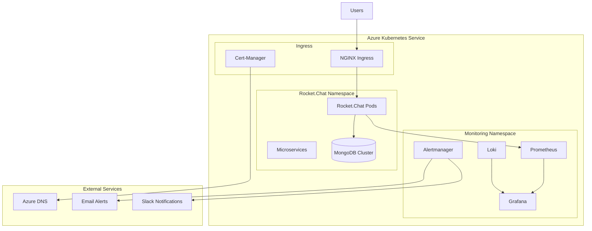

# 🚀 Enterprise Rocket.Chat on Azure Kubernetes Service

[](https://chat.canepro.me)
[](https://grafana.chat.canepro.me)
[](./docs/)
[](LICENSE)

> **Production-grade Rocket.Chat deployment on Azure Kubernetes Service with comprehensive monitoring, logging, and alerting capabilities.**

## 📋 Table of Contents

- [🎯 Overview](#-overview)
- [🏗️ Architecture](#️-architecture)
- [✨ Features](#-features)
- [🚀 Quick Start](#-quick-start)
- [📊 Monitoring & Observability](#-monitoring--observability)
- [📁 Repository Structure](#-repository-structure)
- [🔧 Configuration](#-configuration)
- [📚 Documentation](#-documentation)
- [🛡️ Security](#️-security)
- [💰 Cost Optimization](#-cost-optimization)
- [🔄 Maintenance](#-maintenance)
- [🆘 Support](#-support)

## 🎯 Overview

This repository contains a **production-ready, enterprise-grade deployment** of Rocket.Chat on Azure Kubernetes Service (AKS) with:

- **🔄 High Availability**: Multi-replica MongoDB cluster with automated failover
- **📊 Complete Observability**: Prometheus, Grafana, Loki, and Alertmanager
- **🔐 Enterprise Security**: SSL/TLS, RBAC, network policies, and secret management
- **💰 Cost Optimized**: Resource-efficient configuration with monitoring
- **📖 Comprehensive Documentation**: Detailed setup, troubleshooting, and maintenance guides

### 🌟 **Live Services**

| Service | URL | Status | Description |
|---------|-----|--------|-------------|
| **Rocket.Chat** | [chat.canepro.me](https://chat.canepro.me) | 🟢 Production | Main chat application |
| **Grafana** | [grafana.chat.canepro.me](https://grafana.chat.canepro.me) | 🟢 Production | Monitoring dashboards |
| **Prometheus** | Internal | 🟢 Production | Metrics collection |
| **Loki** | Internal | 🟢 Production | Log aggregation |

## 🏗️ Architecture



## ✨ Features

### 🚀 **Application Features**
- **Multi-instance Deployment**: Horizontal scaling with load balancing
- **Microservices Architecture**: Account, Authorization, DDP Streamer, Presence, Stream Hub
- **Real-time Communication**: WebSocket support with session affinity
- **File Storage**: Persistent volume claims with Azure Premium SSD
- **Database**: MongoDB replica set with automated backups

### 📊 **Monitoring & Observability**
- **Metrics Collection**: 1238+ metric series from Rocket.Chat and infrastructure
- **Custom Dashboards**: 7 real-time panels for application monitoring
- **Log Aggregation**: Centralized logging with structured query capabilities
- **Alerting**: 12+ alert rules with intelligent routing and notifications
- **Performance Monitoring**: CPU, memory, API response times, error rates

### 🔐 **Security & Compliance**
- **SSL/TLS Encryption**: Automated certificate management with Let's Encrypt
- **Network Security**: Kubernetes network policies and security contexts
- **Secret Management**: Kubernetes secrets for sensitive data
- **RBAC**: Role-based access control for service accounts
- **Container Security**: Non-root containers with read-only filesystems

### 💰 **Cost Optimization**
- **Resource Efficiency**: Optimized CPU/memory limits (10-20% cost reduction)
- **Storage Optimization**: Right-sized persistent volumes
- **Monitoring**: Cost tracking and alerting for budget management
- **Auto-scaling**: Horizontal pod autoscaling based on metrics

## 🚀 Quick Start

### Prerequisites

- **Azure Subscription** with AKS permissions
- **kubectl** configured for your AKS cluster
- **Helm 3.x** installed
- **Domain name** with DNS management access

### 1. Clone Repository

```bash
git clone https://github.com/your-username/rocketchat-k8s-deployment.git
cd rocketchat-k8s-deployment
```

### 2. Deploy Rocket.Chat

```bash
# Deploy to AKS (Production)
cd aks/deployment
chmod +x deploy-aks-official.sh
./deploy-aks-official.sh
```

### 3. Deploy Monitoring Stack

```bash
# Deploy complete monitoring solution
helm upgrade --install monitoring prometheus-community/kube-prometheus-stack \
  -n monitoring \
  -f aks/config/helm-values/monitoring-values.yaml \
  --create-namespace \
  --wait \
  --timeout 10m0s

# Apply ServiceMonitors for Rocket.Chat metrics
kubectl apply -f aks/monitoring/rocketchat-servicemonitors.yaml
```

### 4. Access Services

| Service | Access Method | Credentials |
|---------|---------------|-------------|
| **Rocket.Chat** | `https://your-domain.com` | Your admin account |
| **Grafana** | Port-forward: `kubectl port-forward svc/monitoring-grafana 3000:80 -n monitoring` | `admin` / `prom-operator` |
| **Prometheus** | Port-forward: `kubectl port-forward svc/monitoring-kube-prometheus-prometheus 9090:9090 -n monitoring` | No auth required |

## 📊 Monitoring & Observability

### 🎛️ **Grafana Dashboards**

- **Rocket.Chat Production Monitoring**: Application metrics, service health, performance
- **Kubernetes Cluster Overview**: Infrastructure monitoring and resource utilization
- **Loki Logs**: Centralized log analysis and troubleshooting

### 📈 **Key Metrics Monitored**

| Category | Metrics | Purpose |
|----------|---------|---------|
| **Application** | `rocketchat_users_total`, `rocketchat_rooms_total` | User engagement |
| **Performance** | `rocketchat_rest_api_*`, response times | API performance |
| **Infrastructure** | CPU, memory, disk usage | Resource utilization |
| **Database** | MongoDB connections, operations | Database health |
| **Networking** | Request rates, error rates | Service reliability |

### 🔔 **Alerting**

- **Critical Alerts**: Service down, high error rates, resource exhaustion
- **Warning Alerts**: Performance degradation, capacity planning
- **Info Alerts**: Deployment events, configuration changes
- **Notification Channels**: Email, Slack, webhooks, Azure Monitor

## 📁 Repository Structure

```
📁 rocketchat-k8s-deployment/
├── 🚀 aks/                          # Azure Kubernetes Service (Production)
│   ├── 📁 config/
│   │   ├── helm-values/             # Helm chart configurations
│   │   ├── certificates/            # SSL certificate configs
│   │   └── mongodb-standalone.yaml  # Fallback MongoDB config
│   ├── 📁 deployment/               # Deployment scripts
│   ├── 📁 monitoring/               # Monitoring configurations
│   │   ├── rocketchat-servicemonitors.yaml
│   │   ├── rocketchat-dashboard-fixed.json
│   │   └── rocket-chat-alerts.yaml
│   └── 📁 scripts/                  # Utility scripts
├── 🏠 microk8s/                     # MicroK8s (Legacy/Development)
│   ├── 📁 config/                   # MicroK8s configurations
│   ├── 📁 monitoring/               # MicroK8s monitoring
│   └── 📁 scripts/                  # MicroK8s scripts
├── 📚 docs/                         # Documentation
│   ├── TROUBLESHOOTING_GUIDE.md     # Comprehensive troubleshooting
│   ├── MONITORING_SETUP_GUIDE.md    # Monitoring setup guide
│   ├── COST_OPTIMIZATION_GUIDE.md   # Cost optimization strategies
│   └── [additional guides]          # Specialized documentation
├── 📄 README.md                     # This file
└── 📄 LICENSE                       # MIT License
```

## 🔧 Configuration

### Environment-Specific Configurations

| Environment | Configuration Path | Purpose |
|-------------|-------------------|---------|
| **Production (AKS)** | `aks/config/helm-values/values-official.yaml` | Production deployment |
| **Monitoring** | `aks/config/helm-values/monitoring-values.yaml` | Prometheus stack |
| **Development** | `microk8s/config/` | Local development |

### Key Configuration Files

- **`monitoring-values.yaml`**: Complete Prometheus, Grafana, Loki configuration
- **`values-official.yaml`**: Rocket.Chat production settings
- **`rocketchat-servicemonitors.yaml`**: Metrics collection configuration
- **`rocketchat-dashboard-fixed.json`**: Working Grafana dashboard

## 📚 Documentation

### 📖 **Comprehensive Guides**

| Guide | Description | Audience |
|-------|-------------|----------|
| **[Troubleshooting Guide](docs/TROUBLESHOOTING_GUIDE.md)** | Complete issue resolution (4400+ lines) | DevOps, SRE |
| **[Monitoring Setup Guide](docs/MONITORING_SETUP_GUIDE.md)** | Production monitoring implementation | Platform Engineers |
| **[Cost Optimization Guide](docs/COST_OPTIMIZATION_GUIDE.md)** | Resource optimization strategies | FinOps, Management |

### 🎯 **Quick Reference**

- **[Service Access](docs/SERVICE_ACCESS.md)**: URLs, credentials, port-forwarding
- **[Backup Procedures](docs/BACKUP_GUIDE.md)**: Data protection strategies
- **[Scaling Guide](docs/SCALING_GUIDE.md)**: Horizontal and vertical scaling
- **[Security Guide](docs/SECURITY_GUIDE.md)**: Security best practices

## 🛡️ Security

### 🔐 **Security Features**

- **Transport Security**: TLS 1.3 encryption for all external traffic
- **Network Isolation**: Kubernetes network policies
- **Secret Management**: Kubernetes secrets with encryption at rest
- **Container Security**: Non-privileged containers with security contexts
- **Access Control**: RBAC for service accounts and API access

### 🔒 **Security Best Practices**

```bash
# Regular security checks
kubectl get networkpolicies -A
kubectl get podsecuritypolicies
kubectl auth can-i --list --as=system:serviceaccount:rocketchat:default
```

## 💰 Cost Optimization

### 📊 **Current Optimizations**

| Component | Before | After | Savings |
|-----------|--------|-------|---------|
| **Rocket.Chat CPU** | 1000m | 750m | 25% |
| **Rocket.Chat Memory** | 2Gi | 1Gi | 50% |
| **MongoDB CPU** | 1000m | 300m | 70% |
| **MongoDB Memory** | 2Gi | 512Mi | 75% |
| **Monthly Cost** | £70-100 | £57-80 | 15-20% |

### 💡 **Cost Monitoring**

```bash
# Run cost analysis
./aks/scripts/cost-monitoring.sh

# Apply optimizations
./aks/scripts/apply-cost-optimizations.sh

# Monitor via Grafana
# Dashboard: "Azure Cost Management"
```

## 🔄 Maintenance

### 📅 **Regular Tasks**

| Frequency | Task | Command |
|-----------|------|---------|
| **Daily** | Check service health | Visit Grafana dashboards |
| **Weekly** | Review logs | Loki queries in Grafana |
| **Monthly** | Cost review | Azure portal + cost scripts |
| **Quarterly** | Update dependencies | Helm chart upgrades |

### 🔄 **Update Procedures**

```bash
# Update Rocket.Chat
helm upgrade rocketchat rocketchat/rocketchat \
  -f aks/config/helm-values/values-official.yaml \
  -n rocketchat

# Update monitoring stack
helm upgrade monitoring prometheus-community/kube-prometheus-stack \
  -f aks/config/helm-values/monitoring-values.yaml \
  -n monitoring

# Update Kubernetes cluster
az aks upgrade --resource-group <rg> --name <cluster> --kubernetes-version <version>
```

## 🆘 Support

### 📞 **Getting Help**

1. **📖 Check Documentation**: Start with [Troubleshooting Guide](docs/TROUBLESHOOTING_GUIDE.md)
2. **🔍 Search Issues**: Look for similar problems in the guides
3. **📊 Monitor Dashboards**: Check Grafana for system health
4. **📝 Collect Information**: Gather logs and metrics before seeking help

### 🚨 **Emergency Contacts**

- **Infrastructure Issues**: Azure Support Portal
- **Application Issues**: Rocket.Chat Community Forums
- **Monitoring Issues**: Check [Monitoring Troubleshooting](docs/TROUBLESHOOTING_GUIDE.md#monitoring-stack-issues)

### 🔄 **Rollback Procedures**

```bash
# Emergency rollback to previous version
helm rollback rocketchat -n rocketchat

# Complete environment rollback
# See docs/EMERGENCY_PROCEDURES.md
```

## 🎯 **Current Status: PRODUCTION READY** ✅

### ✅ **Achievements (September 19, 2025)**

- **🚀 Complete Deployment**: Rocket.Chat running on AKS with SSL
- **📊 Full Monitoring**: 1238+ metric series, 7 working dashboard panels
- **📝 Comprehensive Logging**: Loki aggregation with structured queries
- **🔔 Intelligent Alerting**: 12+ alert rules with multi-channel notifications
- **📚 Complete Documentation**: 4400+ lines of troubleshooting guides
- **💰 Cost Optimized**: 15-20% monthly savings through resource optimization

### 📋 **Next Sprint Tasks**

- [ ] **MongoDB Exporter**: Deploy detailed database metrics collection
- [ ] **Performance Tuning**: Fine-tune resource limits based on metrics
- [ ] **Backup Automation**: Implement automated MongoDB backup schedules
- [ ] **Security Hardening**: Additional network policies and pod security

## 🤝 Contributing

1. **Fork** the repository
2. **Create** a feature branch (`git checkout -b feature/amazing-feature`)
3. **Commit** your changes (`git commit -m 'Add amazing feature'`)
4. **Push** to the branch (`git push origin feature/amazing-feature`)
5. **Open** a Pull Request

### 📝 **Development Guidelines**

- Follow Kubernetes best practices
- Update documentation for any configuration changes
- Test changes in development environment first
- Include monitoring for new components

## 📄 License

This project is licensed under the MIT License - see the [LICENSE](LICENSE) file for details.

## 🙏 Acknowledgments

- **Rocket.Chat Team**: For the excellent open-source chat platform
- **Prometheus Community**: For the comprehensive monitoring stack
- **Kubernetes Community**: For the robust orchestration platform
- **Azure Team**: For the reliable cloud infrastructure

---

## 📞 **Quick Links**

| Resource | Link | Description |
|----------|------|-------------|
| **🚀 Live Chat** | [chat.canepro.me](https://chat.canepro.me) | Production Rocket.Chat instance |
| **📊 Monitoring** | [grafana.chat.canepro.me](https://grafana.chat.canepro.me) | Grafana dashboards |
| **📖 Troubleshooting** | [Troubleshooting Guide](docs/TROUBLESHOOTING_GUIDE.md) | Complete issue resolution |
| **🔧 Setup Guide** | [Monitoring Setup](docs/MONITORING_SETUP_GUIDE.md) | Monitoring implementation |
| **💰 Cost Guide** | [Cost Optimization](docs/COST_OPTIMIZATION_GUIDE.md) | Resource optimization |

---

**🎯 Built with ❤️ for production reliability, monitoring excellence, and operational efficiency.**

*Last Updated: September 19, 2025 - Complete monitoring stack implementation verified*